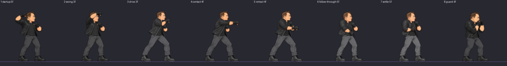
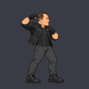

# booster:heavy — clip audit

loop `once`, 8 drawings, 33 engine frames.

| # | pose | hold | top | bottom | height | torso back | head | pop dx,dy | IoU |
| --- | --- | --- | --- | --- | --- | --- | --- | --- | --- |
| 1 | startup | 5 | 17 | 119 | 103 | 43.0 | 38 | - | - |
| 2 | swing | 3 | 17 | 119 | 103 | 46.0 | 26 | -2,+0 | 0.73 |
| 3 | drive | 3 | 16 | 119 | 104 | 48.0 | 20 | -4,+0 | 0.72 |
| 4 | contact | 4 | 16 | 119 | 104 | 47.0 | 19 | +1,+0 | 0.82 |
| 5 | retract | 4 | 16 | 119 | 104 | 48.0 | 20 | +2,+0 | 0.75 |
| 6 | follow-through | 5 | 17 | 119 | 103 | 45.0 | 20 | +4,+0 | 0.90 |
| 7 | settle | 5 | 17 | 119 | 103 | 44.0 | 20 | +0,+0 | 0.95 |
| 8 | guard | 4 | 18 | 119 | 102 | 44.0 | 27 | -1,+0 | 0.89 |

## Result

- pass
- warn startup: head band 38 px against the anchor's 21 (81%) - check the drawing's scale
- warn swing: head band 26 px against the anchor's 21 (24%) - check the drawing's scale
- warn guard: head band 27 px against the anchor's 21 (29%) - check the drawing's scale

