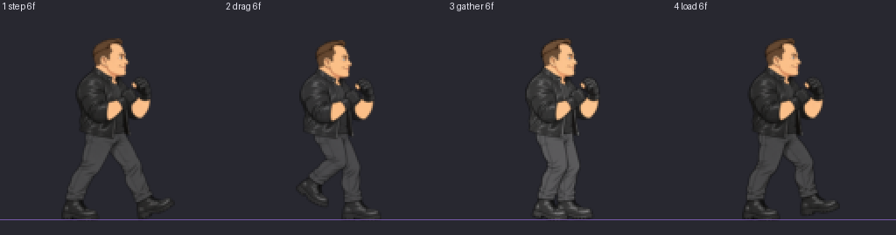
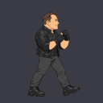

# booster:walk-forward — clip audit

loop `loop`, 4 drawings, 24 engine frames.

| # | pose | hold | top | bottom | height | torso back | head | pop dx,dy | IoU |
| --- | --- | --- | --- | --- | --- | --- | --- | --- | --- |
| 1 | step | 6 | 15 | 119 | 105 | 45.0 | 21 | +0,+0 | 0.98 |
| 2 | drag | 6 | 16 | 119 | 104 | 45.0 | 21 | +0,+0 | 0.94 |
| 3 | gather | 6 | 15 | 119 | 105 | 45.0 | 21 | -1,+1 | 0.99 |
| 4 | load | 6 | 15 | 119 | 105 | 45.0 | 22 | +0,+0 | 0.98 |

## Result

- pass

