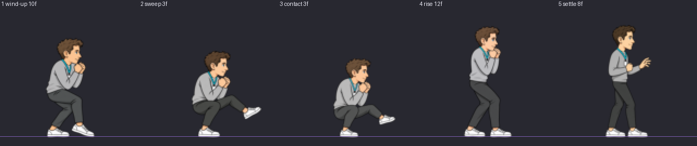

# oracle:heavy — clip audit

loop `once`, 5 drawings, 36 engine frames.

| # | pose | hold | top | bottom | height | torso back | head | pop dx,dy | IoU |
| --- | --- | --- | --- | --- | --- | --- | --- | --- | --- |
| 1 | wind-up | 10 | 28 | 119 | 92 | 45.0 | 25 | - | - |
| 2 | sweep | 3 | 40 | 119 | 80 | 50.0 | 25 | -4,+0 | 0.51 |
| 3 | contact | 3 | 47 | 119 | 73 | 53.0 | 24 | -2,-4 | 0.69 |
| 4 | rise | 12 | 17 | 119 | 103 | 47.0 | 23 | +4,+4 | 0.21 |
| 5 | settle | 8 | 16 | 119 | 104 | 46.0 | 22 | +2,+1 | 0.73 |

## Result

- pass
- warn wind-up: head band 25 px against the anchor's 21 (19%) - check the drawing's scale
- warn sweep: head band 25 px against the anchor's 21 (19%) - check the drawing's scale

